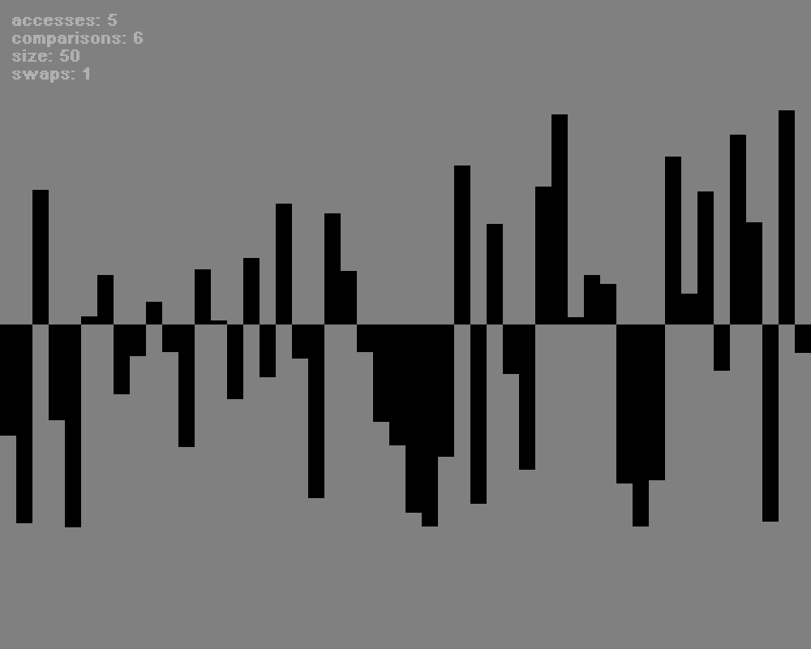

# Sorting Algorithms Visualizer
Simple, command line controlled, visualizer of the sorting process of different sorting algorithms. It was developped under `Ubuntu 22.10 x64` using `C` and `SDL2` as a graphical support.

# Setup
```shell
42sh> chmod +x setup.sh
42sh> ./setup.sh
```

# Usage
The `main` binary accepts one positional argument, the `format`. It consists of the name of the sorting algorithm to use, the order and the amount of integers to sort. The order is either `a`scending or `d`escending.

The `format` is regex represented as `[bBcCiIqQsS][aAdD][0-9]+`. The beggining of the `format` is the first letter of the name of the sorting algorithm, just after the order to sort in and then the amount of integers.

Current supported sorting algorithms:
- `B`ubble
- `C`ocktail
- `I`nsertion
- `Q`uick
- `S`election

```shell
42sh> make main
42sh> ./main <FORMAT>
```

Example:

```shell
42sh> make main
42sh> ./main qa50
```



# Specifications

- The amount of integers to sort has to be greater than 0 but less or equal to `WIDTH` from `src/visualizer/visualizer.h`. This is because each number is represented by a `SDL_Rect` structure whose width can not be 0 in order to be graphically seen.
- The height, representing the number itself, is adapted with respect to the maximum value among all to be sorted. Numbers are represented at a `2/3` scale meaning that only `67%` of the height of both, positive and negative, sides is used.
